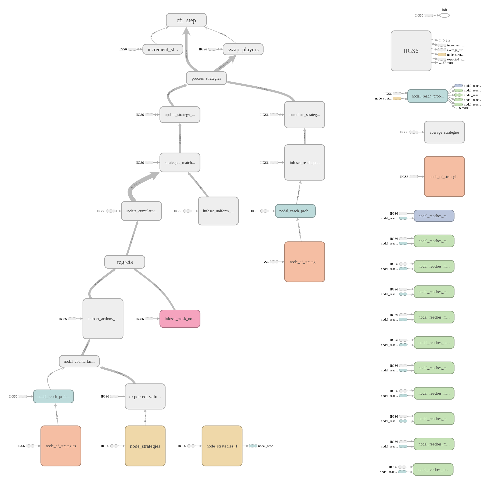
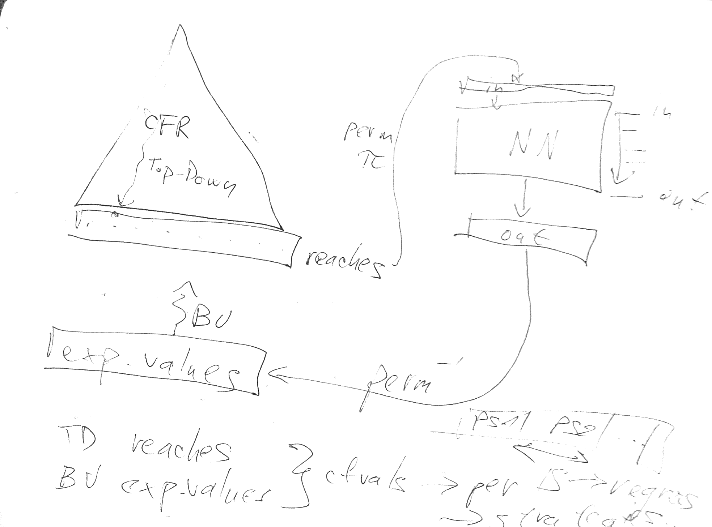
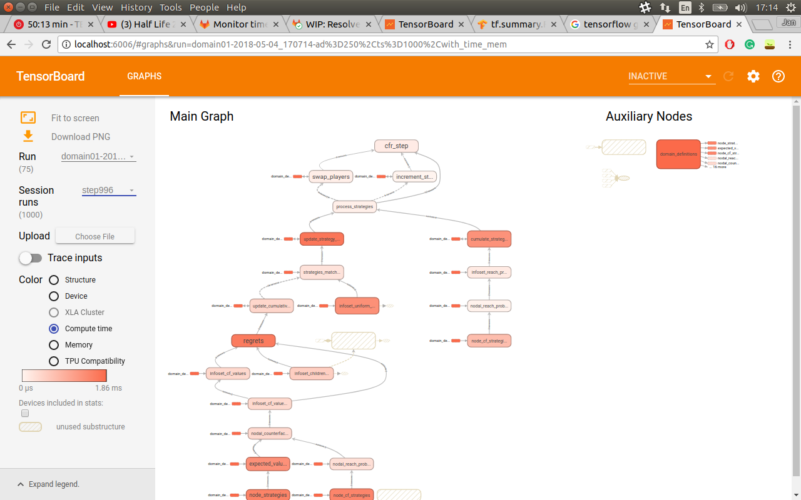

# TensorCFR

[](https://gitlab.com/beyond-deepstack/TensorCFR/pipelines)
[](https://gitlab.com/beyond-deepstack/TensorCFR/commits/master)

an implementation of [CFR+](https://arxiv.org/abs/1407.5042) with TensorFlow tensors (for GPU)

# How to use

To see what is the input, output or parameters of each functionality, see the mentioned `*.py` files.

## CFR



Versions:
1. `src/algorithms/tensorcfr`
2. `src/algorithms/tensorcfr_flattened_domains`: rewritten #1 but for flattened domains
3. `src/algorithms/tensorcfr_fixed_trunk_strategies`: #2 with additional functionality
    - no updates of infoset in trunk levels
    - storing information/statistics (reach probabilities, expected values) at boundary level (between trunk and the bottom of the tree)
    - etc.
4. `src/algorithms/tensorcfr_nn`: child class of #3, some methods overriden (see the screenshot above)
5. `src/algorithms/tensorcfr_best_response`: child class of #3, some methods overriden

For good introduction of understanding TensorCFR, see `src/algorithms/tensorcfr/`:
 1. `topdown_reach_probabilities.py`
 2. `bottomup_expected_values.py` 
 3. `counterfactual_values.py`
 4. `regrets.py`
 5. `strategy_matched_to_regrets.py`
 6. `update_strategies.py`
 7. `swap_players.py`
 8. `node_strategies.py`
 9. `uniform_strategies.py`
10. `cfr_step.py`

## CFR + NN



Located at `src/algorithms/tensorcfr_nn`, the class `TensorCFR_NN(TensorCFRFixedTrunkStrategies)` implements CFR with a NN.

Two ways:
- online training: `src/algorithms/tensorcfr_nn/tensorcfr_CNN_IIGS6_td10_online_training.py`
- NN loaded from a checkpoint file: `src/algorithms/tensorcfr_nn/tensorcfr_CNN_IIGS6_td10_from_ckpt.py`
    - first traing
    - store to `.ckpt` file
    - load from this file (as saved model): `runner.restore_from_ckpt()`

Prediction:
- `src/algorithms/tensorcfr_nn/tensorcfr_CNN_IIGS6_td10_from_ckpt.py`
- `TensorCFR_NN.predict_equilibrial_values()`

Permutation:
- for grouping nodes/histories per public states <- they need to be next to each other (for `tf.reduce_mean`)
- Pandas: `src/nn/features/goofspiel/IIGS6/sorting_permutation_by_public_states.py`
    - radix sort/merge sort on round results: `get_permutation_by_public_states(verbose=False)`

### Experiments for TensorCFR_NN
- `experiments/tensorcfr_nn/IIGS6Lvl10_FromCkptMetacentrum/1layer_tensorcfr_cnn_iigs6_td10_from_ckpt_argparse@meta.sh`

## Dataset generation


Input to NN (per each node):
- features (round results, player's cards, opponent's cards) -> 1-hot encoding
- reach probability (given some initial strategy at the trunk of game tree)

Output of NN (per each node):
- expected value under (almost) Nash equilibrium strategy

Seeds:
- loop over seeds: `src/algorithms/tensorcfr_fixed_trunk_strategies/TensorCFRFixedTrunkStrategies.py`
    `for self.dataset_seed in range(dataset_seed_to_start, dataset_seed_to_start + dataset_size):`

Examples:
- `TensorCFR/src/nn/data/generate_data_of_IIGS6.py`
/home/mathemage/beyond-deepstack/TensorCFR/src/nn/data/generate_data.py
 - generate_dataset_single_session
 - randomize_strategiesV

Post-process dataset
- Pandas: features.csv -> 1-hot encoding as tf.Constant -> concat to NN as input
- npz
- tfrecords

## NN

- 1-hot-encoded features are replicated via `tf.tile()` in the NN. E.g. in `src/nn/ConvNet_IIGS6Lvl10.py`:

```python
self._one_hot_features_tf = tf.constant(
    self._one_hot_features_np,
    dtype=FLOAT_DTYPE,
    name="one_hot_features"
)
self.tiled_features = tf.tile(
    tf.expand_dims(self._one_hot_features_tf, axis=0),
    multiples=[tf.shape(self.input_reaches)[0], 1, 1],
    name="tiled_1hot_features"
)
```

## Exploitability via CFR

input/output or how to run it
In `src/algorithms/tensorcfr_best_response`:
- `class TensorCFR_BestResponse(TensorCFRFixedTrunkStrategies)`
```python
TensorCFR_BestResponse(
    best_responder=PLAYER1,
    trunk_strategies=self._trunk_strategies,
    domain=domain,
    trunk_depth=self._trunk_depth
)
```

- `class ExploitabilityByTensorCFR`

Note: exploitability is average here, it is sum in gtlibrary

E.g.
- `exploitability_IIGS3_td7.py` 
- `exploitability_IIGS6_entire_tree.py` 

## Profiling

(by @janrudolf from [#66](https://gitlab.com/beyond-deepstack/TensorCFR/issues/66))



1) To see computation time and memory consumption in TensorBoard:

   1.  Run the `tensorcfr.py`. 
   2.  Run TensorBoard. 
   3.  As in the picture, choose the latest run of `tensorcfr.py` in the rolldown menu named `Run`.
   4.  Choose the name with `*,with_time_mem`. 
   5.  After that, you can choose which step you want, then you are able to choose `Compute time` and click on the node to investigate it.

2) To compute the total compute time per one CFR step/iteration, the [TF Profiler](https://www.tensorflow.org/api_docs/python/tf/profiler/Profiler) is used.

It prints (for `profiling=True`) a table as command line output like this (accelerator = gpu/tpu):

```
==================Model Analysis Report======================
node name | requested bytes | total execution time | acceVlerator execution time | cpu execution time
_TFProfRoot (--/4.38KB, --/1.04ms, --/0us, --/1.04ms)
  domain_definitions (0B/1.48KB, 0us/280us, 0us/0us, 0us/280us)
    domain_definitions/NotEqual_1 (4B/4B, 21us/21us, 0us/0us, 21us/21us)
    domain_definitions/signum_of_current_player (4B/12B, 12us/20us, 0us/0us, 12us/20us)
      domain_definitions/signum_of_current_player/e (4B/4B, 4us/4us, 0us/0us, 4us/4us)
      domain_definitions/signum_of_current_player/t (4B/4B, 4us/4us, 0us/0us, 4us/4us)
    domain_definitions/Select_1 (120B/120B, 13us/13us, 0us/0us, 13us/13us)
    domain_definitions/cumulative_infoset_strategies_lvl0 (20B/20B, 13us/13us, 0us/0us, 13us/13us)
    domain_definitions/NotEqual (1B/5B, 7us/11us, 0us/0us, 7us/11us)
      domain_definitions/NotEqual/y (4B/4B, 4us/4us, 0us/0us, 4us/4us)
    domain_definitions/Select (60B/60B, 11us/11us, 0us/0us, 11us/11us)
    domain_definitions/node_to_infoset_lvl0 (4B/4B, 9us/9us, 0us/0us, 9us/9us)
    domain_definitions/current_opponent (4B/4B, 8us/8us, 0us/0us, 8us/8us)
    domain_definitions/Equal_2 (1B/1B, 7us/7us, 0us/0us, 7us/7us)
    domain_definitions/current_updating_player (4B/4B, 7us/7us, 0us/0us, 7us/7us)
    domain_definitions/cumulative_infoset_strategies_lvl2 (72B/72B, 7us/7us, 0us/0us, 7us/7us)
    domain_definitions/cumulative_infoset_strategies_lvl1 (48B/48B, 7us/7us, 0us/0us, 7us/7us)
    domain_definitions/node_to_infoset_lvl2 (60B/60B, 7us/7us, 0us/0us, 7us/7us)
    domain_definitions/Variable_2 (120B/120B, 7us/7us, 0us/0us, 7us/7us)
    domain_definitions/positive_cumulative_regrets_lvl0 (20B/20B, 7us/7us, 0us/0us, 7us/7us)
    domain_definitions/positive_cumulative_regrets_lvl1 (48B/48B, 7us/7us, 0us/0us, 7us/7us)
    domain_definitions/NotEqual_2 (9B/9B, 7us/7us, 0us/0us, 7us/7us)
```

